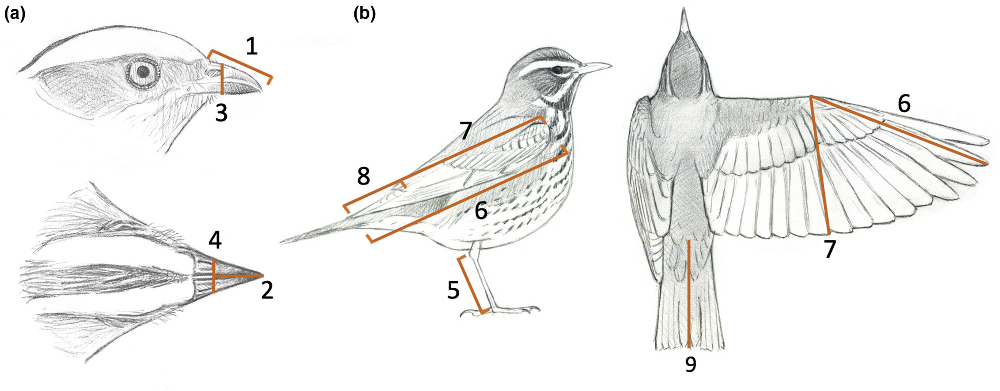

# Bird Identification Model

Beth Harvey
October 22, 2023
Data Analytics Capstone Project

## Introduction

As climate change, habitat loss, and disease continue to threaten wildlife through- out the world, detailed research is becoming more and more important. In 2023 alone, the U.S. Fish and Wildlife service took 21 species off of the Endangered Species Act list because they are now considered extinct [6]. Ten of those 21 species are birds. More research and resources are needed to develop effective conservation efforts. Some key components of bird conservation research are being able to accurately classify individual specimens, as well as being able to identify potential connections between different species. One of the most valuable resources for
an effort like this is an extensive collection of detailed measurements for a wide variety of species. There are several different families of birds that are difficult to differentiate. One of the more challenging pairs is old-world sparrows and new-world sparrows [2]. Both families are part of the order Passeriformes, but the old-world spar- rows make up the Passeridae family, while the new-world sparrows compose the Passerellidae family [4] [3]. New-world sparrows are native to North America, while old-world sparrows are native to Europe, but are also widespread in North America as introduced species [2]. It is important to be able to distinguish if a specimen is an old-world or new-world sparrow before exploring conservation efforts, so that these efforts can focus on helping native species, not introduced ones.

### Project Goals

The end goal of this project is to build a model that can predict what taxonomic order a bird falls into based on several physical measurements. This could help researchers more accurately classify individuals when two or more species are possible. The model will be trained and tested using the AVONET dataset [8], a collective effort by researchers and volunteers to provide measurements of over 90,000 specimens of over 11,000 bird species. 

### Process

The following plan was be followed to complete this project:

   1. Collect data
   2. Clean and transform data
   3. Exploratory data analysis
   4. Split data into train and test sets
   5. Build and train model
   6. Test model
   7. Tune model as needed
   8. Compile and discuss results

The key components of this process are the data preparation and model tuning. The success of the model depended heavily on both of those pieces. The dataset was pretty clean already, so standardizing and/or scaling was the biggest component of preparation. The biggest limitation was the achievable accuracy of the model. There are a lot of very similar bird species, so identifying the species accurately enough to make a good model may be beyond the scope of this project. The model may be limited to identifying the family a particular bird belongs to instead.

### Data

The data used for this project is from a large, collective effort known as the AVONET dataset. It is a collection of physical measurements, habitat information, and geographic information for over 90,000 specimens representing over 11,000 species of birds [8]. The majority of individuals measured were museum specimens, though many live birds were included as well. The raw data can be downloaded as Microsoft Excel files from https://figshare.com/s/b990722d72a26b5bfead [7]. The physical measurements are described in the Metadata sheet of Supplementary dataset 1 from the link above, and they are also shown in the figure below [8].

The measurements are:

   1. Beak length from tip to base of skull
   2. Beak length from front edge of nostril to tip
   3. Beak width from front edges of nostrils
   4. Beak depth from front edges of nostrils
   5. Lower leg (tarsus) length
   6. Wing length from bend to end of longest feather 
   7. Wing length from bend to end of outer secondary (shorter) feather
   8. Length from tip of outer secondary (shorter) feather to tip of longest feather
   9. Tail length [8]

The remaining measurements are the mass of the bird and the "hand-wing index," which is calculated using measurements 6 and 8. Information about the bird's habitat, migration pattern(s), eating habits, conservation status, and geographic location are also included [7]. The physical measurements and age, sex, and country are all from the AVONET Raw Data sheet of Supplemental dataset 1, and the geographic and behavior information come from the AVONET3 BirdTree sheet of the same file [7]. The categorical information from the BirdTree sheet was matched to the appropriate raw data record to create the additional features. This sheet was chosen over the AVONET1 BirdLife and AVONET2 eBird sheets because it had a match for 90,303 of the 90,372 raw records, which was the highest of the three. The physical measurements shown in the figure above and the mass and hand-wing index are the key features used for this model.

 The relevant sheets (AVONET Raw Data and AVONET3 BirdTree) were saved CSV files and loaded into Pandas DataFrames for analysis in the [Jupyter Notebook project file](avonet_bird_identification.ipynb).

### Feature Definitions 

| Feature Name | Description | Data Type | Example |
| ------------ | ---------- | --------- | -------- |
| sex | Sex of the observed specimen | String | M |
| age | Age of the specimen, 0 for juvenile, 1 for adult | Integer | 0 |
| beak_length_culmens | Beak length from tip to base of skull | Float | 13.8 |
| beak_width | Beak width from front edges of nostrils | Float | 5.2 |
| beak_depth | Beak depth from front edges of nostrils | Float | 6.8 |
| tarsus_length | Lower leg (tarsus) length | Float | 18.3 |
| wing_length | Wing length from bend to end of longest feather | Float | 93.0 |
| kipps_dist | Length from tip of outer secondary feather to tip of longest feather | Float | 38.0 |
| secondary1 | Wing length from bend to end of outer secondary (shorter) feather | Float | 55.0 |
| hand_wing | 100 * Kipps Distance / Wing Length | Float | 40.90 |
| tail_length | Length of tail from base to tip | Float | 56.0 |
| family | Taxonomic classification of species | String | Passeridae |
| mass | Average mass of recorded specimens for species | Float | 22.3 |
| habitat | Typical environment where the species lives | String | Rock |
| habitat_density | How thickly vegetated the typical habitat is | Integer | 3 |
| migration | The degree to which the species is known to migrate | Integer | 3 |
| trophic_level | The typical diet of the species | String | Herbivore |
| trophic_niche | Where most of the species' food comes from | String | Granivore |
| primary_lifestyle | Where the species spends most of its time | String | Terrestrial |
| centroid_latitude | Latitude of the geographic center of the species' range | Float | 32.97 |
| centroid_longitude | Longitude of the geographic center of the species' range | Float | 52.87 |

### References 

1. Bhattarai, A., T., F.: Knnimputer. https://github.com/scikit-learn/
scikit-learn/blob/093e0cf14/sklearn/impute/_knn.py#L20 (2014), accessed
on October 31, 2023
2. Camfield, A.: Emberizidae buntings, american sparrows, and relatives. https://
animaldiversity.org/accounts/Emberizidae/ (2004), accessed on November 6,
2023
3. Cornell: New world sparrows—passerellidae. https://www.allaboutbirds.org/
guide/browse/taxonomy/Passerellidae (2023), accessed on November 6, 2023
4. Cornell: Old world sparrows—passeridae. https://www.allaboutbirds.org/
guide/browse/taxonomy/Passeridae (2023), accessed on November 6, 2023
5. Pedregosa, F., Varoquaux, G., Gramfort, A., Michel, V., Thirion, B., Grisel, O.,
Blondel, M., Prettenhofer, P., Weiss, R., Dubourg, V., Vanderplas, J., Passos, A.,
Cournapeau, D., Brucher, M., Perrot, M., Duchesnay, E.: Scikit-learn: Machine
learning in Python. Journal of Machine Learning Research 12, 2825–2830 (2011)
6. Schuldheisz, C.: Fish and wildlife service delists 21 species from the endangered
species act due to extinction. https://www.fws.gov/press-release/2023-10/
21-species-delisted-endangered-species-act-due-extinction (2023), ac-
cessed on October 18, 2023
7. Tobias: Avonet: morphological, ecological and geographical data for all birds. https:
//figshare.com/s/b990722d72a26b5bfead (2022), accessed on October 18, 2023
8. Tobias, J.A., Sheard, C., Pigot, A.L., Devenish, A.J.M., Yang, J., Sayol, F., Neate-
Clegg, M.H.C., Alioravainen, N., Weeks, T.L., Barber, R.A., Walkden, P.A., Mac-
Gregor, H.E.A., Jones, S.E.I., Vincent, C., Phillips, A.G., Marples, N.M., Monta ̃no-
Centellas, F.A., Leandro-Silva, V., Claramunt, S., Darski, B., Freeman, B.G., Breg-
man, T.P., Cooney, C.R., Hughes, E.C., Capp, E.J.R., Varley, Z.K., Friedman,
N.R., Korntheuer, H., Corrales-Vargas, A., Trisos, C.H., Weeks, B.C., Hanz, D.M.,
T ̈opfer, T., Bravo, G.A., Remeˇs, V., Nowak, L., Carneiro, L.S., Moncada R., A.J.,
Matysiokov ́a, B., Baldassarre, D.T., Mart ́ınez-Salinas, A., Wolfe, J.D., Chapman,
P.M., Daly, B.G., Sorensen, M.C., Neu, A., Ford, M.A., Mayhew, R.J., Fabio Sil-
veira, L., Kelly, D.J., Annorbah, N.N.D., Pollock, H.S., Grabowska-Zhang, A.M.,
McEntee, J.P., Carlos T. Gonzalez, J., Meneses, C.G., Mu ̃noz, M.C., Powell, L.L.,
Jamie, G.A., Matthews, T.J., Johnson, O., Brito, G.R.R., Zyskowski, K., Crates,
R., Harvey, M.G., Jurado Zevallos, M., Hosner, P.A., Bradfer-Lawrence, T., Maley,
Bird Identification Model 7
J.M., Stiles, F.G., Lima, H.S., Provost, K.L., Chibesa, M., Mashao, M., Howard,
J.T., Mlamba, E., Chua, M.A.H., Li, B., G ́omez, M.I., Garc ́ıa, N.C., P ̈ackert,
M., Fuchs, J., Ali, J.R., Derryberry, E.P., Carlson, M.L., Urriza, R.C., Brzeski,
K.E., Prawiradilaga, D.M., Rayner, M.J., Miller, E.T., Bowie, R.C.K., Lafontaine,
R.M., Scofield, R.P., Lou, Y., Somarathna, L., Lepage, D., Illif, M., Neuschulz,
E.L., Templin, M., Dehling, D.M., Cooper, J.C., Pauwels, O.S.G., Analuddin, K.,
Fjelds ̊a, J., Seddon, N., Sweet, P.R., DeClerck, F.A.J., Naka, L.N., Brawn, J.D.,
Aleixo, A., B ̈ohning-Gaese, K., Rahbek, C., Fritz, S.A., Thomas, G.H., Schleuning,
M.: Avonet: morphological, ecological and geographical data for all birds. Ecology
Letters 25(3), 581–597 (2022). https://doi.org/https://doi.org/10.1111/ele.13898,
https://onlinelibrary.wiley.com/doi/abs/10.1111/ele.13898
